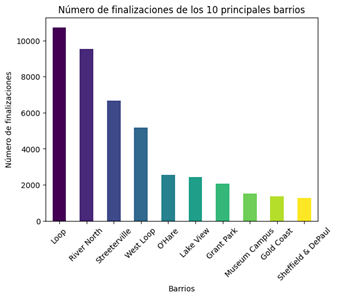
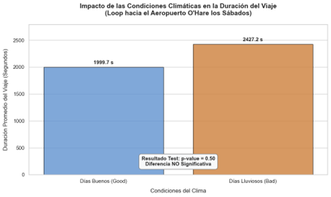

### 🚕 [Ride Analytics (Chicago Shared Rides)]([./](https://github.com/dmgc0920-byte/Ride_Analytics/blob/main/Ride_Analytics.ipynb))
> **Statistical Analysis & Hypothesis Testing on Mobility Patterns**

* **Situation:** A rideshare company entering the Chicago market required data-driven insights into passenger preferences and demand fluctuations under extreme conditions.
* **Task:** Analyze competitor activity across the top 10 neighborhoods and statistically evaluate the impact of adverse weather on weekend trip frequencies.
* **Action:**
  * Executed an Exploratory Data Analysis (EDA) on high-density routes, focusing spatial analysis on the critical *Loop ➡️ Airport* corridor.
  * Formulated and conducted two-sample **Hypothesis Testing (Student's t-test)** to determine statistically significant variations in travel duration during rainy Saturdays.
* **Result:** Statistically validated that rainy weather significantly increases average travel times on Saturdays, providing actionable insights for dynamic pricing models and automated flight-delay warnings for passengers.

**🛠️ Tech Stack:** `Python` | `SciPy` | `Statsmodels` | `Seaborn` | `Hypothesis Testing`

---

***Versión en Español:***
---

### 🚕 [Ride Analytics (Chicago Shared Rides)]([./](https://github.com/dmgc0920-byte/Ride_Analytics/blob/main/Ride_Analytics.ipynb))
> **Análisis Estadístico y Prueba de Hipótesis sobre Patrones de Movilidad**

* **Situación:** Una nueva empresa de viajes compartidos en Chicago requería comprender las preferencias de uso y la variación de la demanda frente a factores externos.
* **Tarea:** Analizar la actividad de la competencia en los 10 principales barrios de la ciudad y probar estadísticamente el impacto del clima severo en la frecuencia de viajes los fines de semana.
* **Acción:**
  * Análisis Exploratorio de Datos (EDA) sobre rutas de alta concurrencia, focalizando el estudio en el trayecto *Loop ➡️ Aeropuerto*.
  * Formulación y ejecución de una **prueba de hipótesis ($t$ de Student)** para determinar el impacto de condiciones meteorológicas adversas en la duración promedio de los viajes.
* **Resultado:** Se demostró estadísticamente que la lluvia incrementa significativamente el tiempo de viaje los días sábado, derivando en recomendaciones operativas para la asignación de tarifas dinámicas y alertas preventivas para evitar pérdidas de vuelos.

**🛠️ Tecnologías:** `Python` | `SciPy` | `Statsmodels` | `Seaborn` | `Pruebas de Hipótesis`

---

